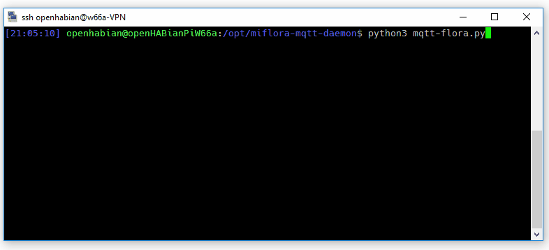

# Xiaomi Mi Flora Plant Sensor MQTT Client/Daemon

A simple Linux python script to query arbitrary Mi Flora plant sensor devices and send the data to an **MQTT** broker,
e.g., the famous [Eclipse Mosquitto](https://projects.eclipse.org/projects/technology.mosquitto).
After data made the hop to the MQTT broker it can be used by home automation software, like [openHAB](https://openhab.org) or Home Assistant.



The program can be executed in **daemon mode** to run continuously in the background, e.g., as a systemd service.

## About Mi Flora
* [Xiaomi Mi Flora sensors](https://xiaomi-mi.com/sockets-and-sensors/xiaomi-huahuacaocao-flower-care-smart-monitor) ([e.g. 12-17€](https://www.aliexpress.com/wholesale?SearchText=xiaomi+mi+flora+plant+sensor)) are meant to keep your plants alive by monitoring soil moisture, soil conductivity and light conditions
* The sensor uses Bluetooth Low Energy (BLE) and has a rather limited range
* A coin cell battery is used as power source, which should last between 1.5 to 2 years under normal conditions
* Food for thought: The sensor can also be used for other things than plants, like in the [fridge](https://community.openhab.org/t/refrigerator-temperature-sensors/40076) or as [door and blind sensor](https://community.openhab.org/t/miflora-cheap-window-and-door-sensor-water-sensor-blind-sensor-etc/38232)

## Features

* Tested with Mi Flora firmware 3.2.1 and 3.3.5
* Tested with VegTrug firmware 3.2.1 (MAC prefix "80:EA:CA")
* Tested on Raspberry Pi 3 and Raspberry Pi 0W
* Tested on Wiren Board 5 (Debian Stretch)
* Build on top of [open-homeautomation/miflora](https://github.com/open-homeautomation/miflora)
* Highly configurable
* Data publication via MQTT
* Announcement messages for automatic discovery by smart home systems
* Configurable topic and payload:
    * JSON encoded
    * following the [Homie Convention v2.0.5](https://github.com/marvinroger/homie)
    * following the [mqtt-smarthome architecture proposal](https://github.com/mqtt-smarthome/mqtt-smarthome)
    * using the [HomeAssistant MQTT discovery format](https://home-assistant.io/docs/mqtt/discovery/)
    * using the [Gladys MQTT proposal](https://gladysassistant.com/docs/integrations/mqtt/)
    * using the [ThingsBoard.io](https://thingsboard.io/) MQTT interface
    * following the [Wiren Board MQTT Conventions](https://github.com/contactless/homeui/blob/master/conventions.md)
* MQTT authentication support
* No special/root privileges needed
* Linux daemon / systemd service, sd\_notify messages generated


### Readings

The Mi Flora sensor offers the following plant and soil readings:

| Name            | Description |
|-----------------|-------------|
| `temperature`   | Air temperature, in [°C] (0.1°C resolution) |
| `light`         | [Sunlight intensity](https://aquarium-digest.com/tag/lumenslux-requirements-of-a-cannabis-plant/), in [lux] |
| `moisture`      | [Soil moisture](https://observant.zendesk.com/hc/en-us/articles/208067926-Monitoring-Soil-Moisture-for-Optimal-Crop-Growth), in [%] |
| `conductivity`  | [Soil fertility](https://www.plantcaretools.com/measure-fertilization-with-ec-meters-for-plants-faq), in [µS/cm] |
| `battery`       | Sensor battery level, in [%] |

## Prerequisites

An MQTT broker is needed as the counterpart for this daemon.
Even though an MQTT-less mode is provided, it is not recommended for normal smart home automation integration.
MQTT is huge help in connecting different parts of your smart home and setting up of a broker is quick and easy.

## Installation

On a modern Linux system just a few steps are needed to get the daemon working.
The following example shows the installation under Debian/Raspbian below the `/opt` directory:

```shell
sudo apt install git python3 python3-pip bluetooth bluez

git clone https://github.com/ThomDietrich/miflora-mqtt-daemon.git /opt/miflora-mqtt-daemon

cd /opt/miflora-mqtt-daemon
sudo pip3 install -r requirements.txt
```

The daemon depends on `gatttool`, an external tool provided by the package `bluez` installed just now.
Make sure gatttool is available on your system by executing the command once:

```shell
gatttool --help
```

## Configuration

To match personal needs, all operation details can be configured using the file [`config.ini`](config.ini.dist).
The file needs to be created first:

```shell
cp /opt/miflora-mqtt-daemon/config.{ini.dist,ini}
vim /opt/miflora-mqtt-daemon/config.ini
```

**Attention:**
You need to add at least one sensor to the configuration.
Scan for available Mi Flora sensors in your proximity with the command:

```shell
$> sudo hcitool lescan

LE Scan ...
4B:47:E2:DE:CE:9A (unknown)
C4:7C:8D:62:72:49 Flower care
84:C0:EF:46:B2:8A (unknown)
10:0B:F1:43:59:16 (unknown)
C4:7C:8D:62:40:29 Flower care
```

By the way:
Interfacing your Mi Flora sensor with this program is harmless.
The device will not be modified and will still work with the official smartphone app.

Some configuration options can be set via environment variables, see `config.ini` for details.

## Execution

A first test run is as easy as:

```shell
python3 /opt/miflora-mqtt-daemon/miflora-mqtt-daemon.py
```

With a correct configuration the result should look similar to the the screencap above.
Pay attention to communication errors due to distance related weak Bluetooth connections.

Using the command line argument `--config`, a directory where to read the config.ini file from can be specified, e.g.

```shell
python3 /opt/miflora-mqtt-daemon/miflora-mqtt-daemon.py --config /opt/miflora-config
```

### Continuous Daemon/Service

You most probably want to execute the program **continuously in the background**.
This can be done either by using the internal daemon or cron.

**Attention:** Daemon mode must be enabled in the configuration file (default).

1. Systemd service - on systemd powered systems the **recommended** option

   ```shell
   sudo cp /opt/miflora-mqtt-daemon/template.service /etc/systemd/system/miflora.service

   sudo systemctl daemon-reload

   sudo systemctl start miflora.service
   sudo systemctl status miflora.service

   sudo systemctl enable miflora.service
   ```

## Usage with Docker

A Dockerfile in the repository can be used to build a docker container from the sources with a command such as:

```shell
docker build -t miflora-mqtt-daemon .
```

Running the container in interactive mode works like this:

```shell
docker run -it --name miflora-mqtt-daemon -v .:/config miflora-mqtt-daemon
```

To run the container in daemon mode use `-d` flag:

```shell
docker run -d --name miflora-mqtt-daemon -v .:/config miflora-mqtt-daemon
```

The `/config` volume can be used to provide a directory on the host which contains your `config.ini` file (e.g. the `.` in the above example could represent `/opt/miflora-mqtt-daemon`).
You may need to tweak the network settings (e.g. `--network host`) for Docker depending on how your system is set up.

It can be worth deleting any redundant images after building a new image:

```shell
docker image prune 
```

## Integration

In the "mqtt-json" reporting mode, data will be published to the MQTT broker topic "`miflora/sensorname`" (e.g. `miflora/petunia`).
An example:

```json
{"light": 5424, "moisture": 30, "temperature": 21.4, "conductivity": 1020, "battery": 100}
```

This data can be subscribed to and processed by other applications.
From this point forward your options are endless.

Enjoy!

### openHAB

The following shows an example of a textual configuration using the MQTT binding introduced with openHAB 2.4.
The example also uses the new internal broker.

##### Thing file

```java
Bridge mqtt:systemBroker:MqttBroker "MQTT Broker" [ brokerid="embedded-mqtt-broker" ]
{
    Thing topic FicusBenjamin "Ficus Benjamin"
    {
        Channels:
            Type number : light         "Light Intensity"   [ stateTopic="miflora/FicusBenjamin", transformationPattern="JSONPATH:$.light" ]
            Type number : battery       "Battery Charge"    [ stateTopic="miflora/FicusBenjamin", transformationPattern="JSONPATH:$.battery" ]
            Type number : temperature   "Temperature"       [ stateTopic="miflora/FicusBenjamin", transformationPattern="JSONPATH:$.temperature" ]
            Type number : conductivity  "Soil Fertility"    [ stateTopic="miflora/FicusBenjamin", transformationPattern="JSONPATH:$.conductivity" ]
            Type number : moisture      "Soil Moisture"     [ stateTopic="miflora/FicusBenjamin", transformationPattern="JSONPATH:$.moisture" ]
    }
}
```

##### Item file

```java
Number:Illuminance      Miflora_Ficus_Light         "Light Intensity Ficus [%d lx]"     <light>         { channel="mqtt:topic:MqttBroker:FicusBenjamin:light" }
Number:Dimensionless    Miflora_Ficus_Battery       "Battery Charge Ficus [%d %%]"      <battery>       { channel="mqtt:topic:MqttBroker:FicusBenjamin:battery" }
Number:Temperature      Miflora_Ficus_Temperature   "Temperature Ficus [%.1f °C]"       <temperature>   { channel="mqtt:topic:MqttBroker:FicusBenjamin:temperature" }
Number                  Miflora_Ficus_Conductivity  "Soil Fertility Ficus [%d µS/cm]"   <lawnmower>     { channel="mqtt:topic:MqttBroker:FicusBenjamin:conductivity" }
Number:Dimensionless    Miflora_Ficus_Moisture      "Soil Moisture Ficus [%d %%]"       <humidity>      { channel="mqtt:topic:MqttBroker:FicusBenjamin:moisture" }
```

### ThingsBoard

To integrate with [ThingsBoard.io](https://thingsboard.io/):

1. in your `config.ini` set `reporting_method = thingsboard-json`
1. in your `config.ini` assign unique sensor names for your plants
1. on the ThingsBoard platform create devices and use `Access token` as `Credential type` and the chosen sensor name as token

### Wiren Board

To integrate with [Wiren Board](https://wirenboard.com/en/) in your `config.ini` set:

1. `reporting_method = wirenboard-mqtt`
1. set `hostname` with address of [Wiren Board](https://wirenboard.com/en/) controller and optionally  `username` and `password`

Your sensors will automatically appear on [Wiren Board](https://wirenboard.com/en/) as separate devices.

----

## Disclaimer and Legal

> *Xiaomi* and *Mi Flora* are registered trademarks of *BEIJING XIAOMI TECHNOLOGY CO., LTD.*
>
> This project is a community project not for commercial use.
> The authors will not be held responsible in the event of device failure or withered plants.
>
> This project is in no way affiliated with, authorized, maintained, sponsored or endorsed by *Xiaomi* or any of its affiliates or subsidiaries.
